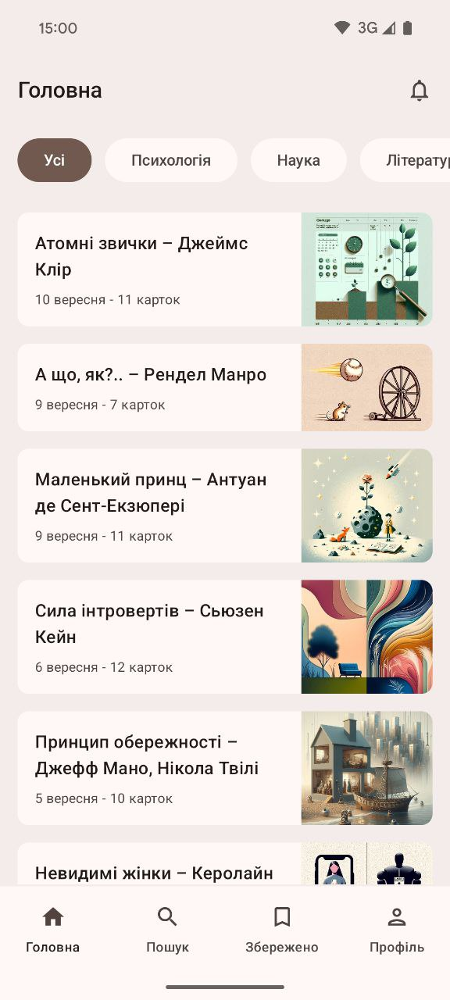
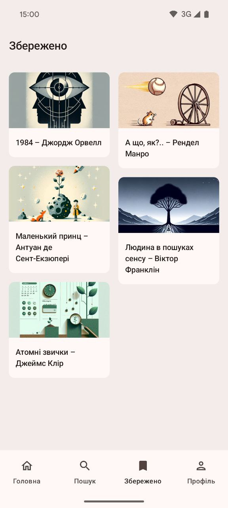

# MindSnack

MindSnack is an Android application that delivers the core ideas of popular books in a fast, intuitive, and engaging format — short, swipeable cards. The goal is to offer a smarter alternative to doom-scrolling on social media by providing quick insights and knowledge from books.

## Tech Stack
- **Language**: Kotlin
- **Architecture**: MVVM (Model–View–ViewModel)
- **DI**: Dagger Hilt
- **UI**: Jetpack Compose, Material 3, Compose Navigation
- **Data**: Coroutines, DataStore, Paging 3
- **Networking**: Retrofit, Gson, OkHttp
- **Auth**: Firebase Authentication
- **Image Loading**: Coil

## Screens
- **Home** – Browse recommended articles and filter them by category (Science, Psychology, Literature).
- **Search** – Search for books by title or author, or suggest a new book if it’s not found.
- **Saved** – Access your saved content in two tabs: saved articles and cards.
- **Profile** – Manage your account info, switch light/dark theme, and control notification settings.
- **Notifications** – View alerts about new articles, content updates, and app announcements.
- **Article** – Read book summaries as swipeable idea cards, view book info, save content, and rate the article.

  

## Demo
> Note: The current version integrates with a backend server (not public yet).

For testing purposes, I created the MVP version of this application with in-memory data. You can download APK [here](https://github.com/Comp-pot/Mindsnack/releases/latest).

